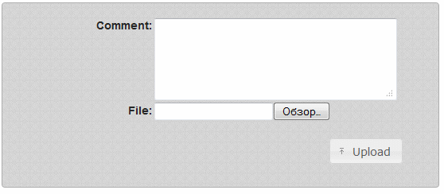
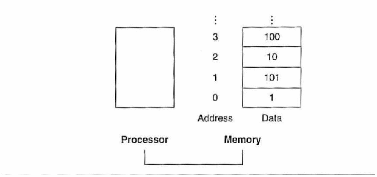
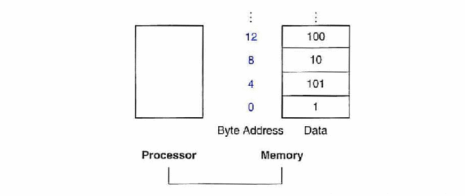
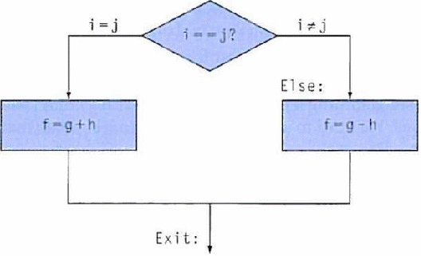
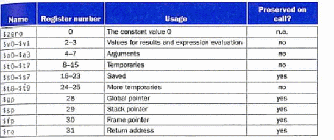

# Вступ

У вік технологічних новацій доволі часто рівень користування цими технологіями
доволі слабкий у порівнянні з реальними можливостями. Розвиток комп’ютерної
техніки та її широке розповсюдження серед практично всіх верств населення,
розповсюдження мережі інтернет сприяють поширенню технологій дистанційного
доступу до актуальної інформації, і річ йде про одне з саме таких нововведень.

Наразі все більшої актуальності набуває дистанційне навчання, за якого студент
практично не залежить від реальної присутності в інституті, що може знаходитись
за сотні кілометрів від реального перебування студента. Часто це буває
необхідним при неспроможності студента бути безпосередньо присутнім на
зайняттях, а описана нижче система дає змогу успішно навчатись і показувати свої
знання та здобувати свої оцінки при несприятливих для відвідування обставинах.
Дана система дозволяє виконувати завдання, відсилати протоколи по виконаній
роботі та, власне, опрацьовувати новий матеріал через мережу інтернет.

На початок 2011 року кількість інтернет користувачів перевищило третину населення
України (загалом це молодь), а отже можна говорити про хороше підґрунтя для
поширення даного способу тестування знань.

Загалом, схема користування даною систему оцінки знань може бути зведена до
досить простих кроків, як-то:
  * Отримання свого логіну та паролю від адміністратора системи

  * Вхід на сайт як зареєстрований користувач і перегляд власних індивідуальних
    завдань, що з’являються і доступі виключно того дня, на який призначено
    заняття.

  * Умова індивідуальна - студент вирішує поставлену перед ним задачу у
    індивідуальному порядку, показує навики володіння матеріалом.

  * Написання тексту відповіді у присутньому у системі редакторі – емуляції
    середовища для моделювання обробки команд процесором MIPS.

  * Також є можливість перевірити виконане завдання на коректність перед тим,
    як відсилати його на перевірку.

  * Оформлення протоколу відбувається на стороні студента, потім кожна робота,
    виконана у системі має бути підтверджена завіреним вчителем протоколом.

  * У протоколі можуть бути викладені коментарі щодо виконаного завдання.
    Обов’язковим являється виконання технічних умов щодо вмісту протоколу
    завдання, як-то описання призначення регістрів, які використовувались,
    та машинний код команди, який генерується, власне, програмним середовищем.

Унікальний момент для викладача – система звільняє і його від рутинної
перевірки завдань, адже у системі є вбудована система тестів, що дозволяє
визначити коректність виконання студентом завдання.
    

Рис. 1

На Рис. 1 представлена схема роботи системи дистанційної перевірки знань.
Даний ресурс відповідає ідеї спрощення проведення лабораторних робіт по
дисципліні «Архітектура операційних систем» і має на меті реалізувати систему
дистанційного виконання студентами завдань, для яких присутність студента
потребувалась раніше виключно через неможливість виконання завдання іншим
способом. Це значне спрощення процесу навчання та вельми корисне нововведення
технологій у навчальних процес.

# Робота з системою дистанційного оцінювання.

Отже ми побачили переваги і можливості, що надає нам дана система контролю і
оцінювання навчального процесу. Тепер давайте детальніше ознайомимося з процесом
роботи з даною системою.

### Вхід в систему.

Для того щоб розпочати роботу з індивідуальним лабораторним завданням необхідно
ввійти в систему, тобто авторизуватися на сайті вказавши свою групу,
прізвище та ім’я (Рис. 2).

Рис. 2 «форма входу»

Рис. 2.1
Зверніть увагу на те, що під час введення групи необхідно ввести лише її
номер, а система автоматично підставить все інше, тобто студент групи КА-85
має ввести FIXME

Рис 2.2
Необхідно також ввести повне прізвище та ім’я

Після того як у відповідні поля буде введено інформацію відобразиться
індивідуальна сторінка студента з станом про виконання лабораторних робіт на
даний момент (Рис 3). А саме:

Рис. 3 «вигляд основної робочої сторінки»

  * Opens дата відкриття завдання конкретної лабораторної роботи
  * Task Type Тип виконуваної роботи
  * Task Name назва лабораторної роботи
  * Status стан цієї лабораторної роботи на даний момент(в процесі перевірки,
    не зроблено, зроблено з відповідною оцінкою);
  * Action FIXME
  * Score максимальна оцінка за дану роботу і отримана студентом оцінка з
    урахування всіх бонусів та відрахувань балів за несвоєчасність виконання
  * Pending Показує, чи є якісь заборгованості по завданням даної роботи
  * Open FIXME
  * Course Файли в цьому розділі показують скільки і які тести має пройти код
    лабораторної роботи. Останній файл у розділі показує приклад вихідного коду.

### Виконання робіт.

Отже після входу в систему починаємо роботу з нею.
Для виконання певної лабораторної роботи необхідно відкрити середовище для
роботи з кодом на асемблері MIPS. Для цього відкриваємо роботу кнопкою Open
навпроти неї. Опиняємося на наступній сторінці (Рис 4). (щоб отримати повну
інформацію в комбобоксі, що виділений червоним обираємо значення Any/Student):

Рис. 4

Вона надає нам наступні можливості:
  * Відправити звіт по відповідній лабораторній роботі – UL
  * Створити програмний код на асемблері MIPS – E

Обравши “E” система відкриває середовище для розробки програмного коду, а також
індивідуальне завдання даної роботи (Рис. 5).

Рис. 5

Наше завдання полягає у створенні програми, що виконуватиме поставлену задачу.
**Наприклад маємо завдання**:

    Виділити нульовий біт регістру $a0 і помістити результат в $v0.

Трішки подумавши ми розуміємо, зо код програми має виглядати приблизно таким
чином:

    andi $v0,$a0,1

Далі, як і в будь-якому іншому середовищі розробки програм, ми маємо
скомпілювати отриманий код і перевірити на наявність помилок.
Для цього використовуємо **Verify**.

Перевірка отриманого коду здійснюється по кільком критеріям і в кілька етапів.
Код вважається правильним якщо він пройшов всі тести.
Цілком природнім є бажання розробника виконати покрокове тестування програми
для виявлення помилок. Для цього обираємо **Assemble> Step>** і покроково
виконуємо кожну оперцію. Або ж **Assemble> Run>** (Рис. 6) - виконуємо всю
програму зразу. Після цього отримуємо результати тестування програми: кількість
пройдених чи не пройдених програмою тестів.

Рис. 6 «середовище відладки коду»

При виникненні помилок чи не проходженні програмою перевірок звичано можна
продовжувати відладку коду зручними для користувача способами. Після того як
всі тести програмою пройдено необхідно відправити програмний код. Це виконується
кнопкою **Submit**.

### Оформлення протоколу.

Залишається заключний етап виконання лабораторної роботи – оформлення звіту.
В звіті мають бути:
 * Назва лабораторної роботи
 * Завдання
 * Опис операндів (призначення кожного регістру в коді програи)
 * Текст програми на асемблера MIPS
 * Машинний код операцій

Система сама генерує машинний код кожної операції програми, тому його не треба
прописувати вручну, а можна скопіювати з вкладки Run> середовища розробки
програми.

Для того, щоб звіт був перевірений викладачем його слід надіслати. Це можна
зробити наступним чином (Рис. 7):
Обравши потрібну лабораторну роботу натискаємо UL. Після чого завантажуємо
зроблений нами звіт на сервер. (Зверніть увагу, що завантажувані файли мають
бути у форматі rtf).

Рис. 7 «форма завантаження протоколу»

### Бонуси та штрафи.

Звичайно ж в данный системі існують деякі правила нарахування заохочувальних
балів старанним студентам.

виконання лабораторної роботи прямо в аудиторії, під час проходження практичного
заняття або до 18.00 поточного дня
+25% від максимального балу за дану лабораторну роботу

Виконання лабораторної роботи під час практичного заняття, але з ip-адреси, що
знаходиться поза межами КПІ
Бонусні бали не нараховуються.

# Комп’ютерний практикум №1.

**Тема**:Арифметичні операції.
**Мета роботи**: Ознайомитися з базовими інструкціями для виконання арифметичних
операцій.

## Теоретичні відомості.

Даний запис ассемблерної команди MIPS:

    add a, b, c

надає комп’ютеру інструкцію додати 2 зміні a та b і записати результат в змінну
с. Ця нотація є жорстко визначеною в кожній арифметичній інструкції MIPS, так як
вона виконує лише одну операцію і завжди повинна мати рівно три операнда.

Наприклад, припустимо, що ми хочемо записати суму чотирьох змінних b, c, d та e
в змінну а. Наступна послідовність команд додає чотири змінні:

    add a, b, c #the sum of b and c is placed in a.
    add a, a, c #the sum of b, c and d is now in a.
    add a, a, e #the sum of b, c, d and e is now in a.

Отже потрібно три інструкції, щоб додати чотири змінні.

Слова праворуч від символу шарп (#) - коментарі, їх комп’ютер ігнорує.
Зауважимо, що на відміну від інших мов програмування кожен рядок цієї мови може
містити не більше однієї команди. Інша відмінність від С, що коментарі завжди
закінчуются в кінці рядка.

Звичайне число операндів для операції як додавання - три: два числа, що
додаються, і змінна, для запису результату. Вимога до кожної команди мати рівно
три операнди свідчить про ідею спрощення апаратного забезпечення: обладнання для
змінної кількості операндів складніше ніж для фіксованої.

Тепер ми можемо показати, в двох прикладах, що показують зв’язок між мовами
високого рівня і більш примітивними інструкціями:

### Перетворення двох команд на мові С в MIPS:

Цей фрагмент коду на С містить 5 операндів a,b,c,d,e:

    a=b+c;
    d=a-e;

Трансляцію із С в асемблер MIPS здійснює компілятор. Отримуємо наступний код.
Інструкції MIPS використовують 2 змінні джерела і записують результат в один
операнд - приймач. Тобто дві попередні інструкції прямо перетворяться в дві
інструкції на асемблері MIPS

    add a, b, c
    sub d, a, e

### Перетворення складних інструкції мови С в MIPS.

Якась складна інструкція містить п’ять змінних f, q, h, i, та j:

    f=(g+h)-(i+j);

Отже, що ми можемо отримати після компіляції? Компілятор має розбити команду на
декілька асемблерних інструкцій, так щоб тільки одна операція припадала на одну
інструкцію. Перша інструкція асемблера MIPS рахує суму g та h. Та ми маємо десь
зберегти результат, тому компілятор створює тимчасову змінну t0.

    add t0, g, h # temporary variable t0 contains g + h

Незважаючи на те, що наступна операція - віднімання, ми маємо порахувати суму
i + j перед тим як віднімати. отже наступна інструкція записує суму i + j в
тимчасову змінну t1:

    add t1, i, j # temporary variable t1 contains i + j

І нарешті віднімаємо від першої суми другу інструкцією віднімання, поміщаємо
різницю в змінну f:

    sub f, t0, t1 # f gets t0-t1 which is (g+h)-(i+j)

### Константи або безпосередні операнди.

Програма багато разів використовує константи  операціях, наприклад: інкремент
індексу для переходу на наступний елемент масиву. Насправді більше половини
арифметичних інструкцій MIPS мають як операнд константу під час запуску
еталонної тестової програми SPEC2006.

Використовуючи лише інструкції, які ми розглядали раніше, ми повинні були б
завантижувати константу з пам’яті, щоб її використовувати(Константи були б
розміщені в пам’яті, коли програма завантажувалась). Альтернатива, яка дозволяє
уникнути навантаження інструкції - запропонувати версії арифметичних команд, в
яких один з операндів - константа. Ця швидка інструкція add з одним константним
операндом називається безпосереднім додаванням (immediate add) або addi. Щоб
додати до 4 регістр $s3 ми просто пишемо:

    addi $s3, $s3, 4 # $s3= $s3+ 4

Константні операнди зустрічаються часто, і включення константних операндів
всередину арифметичних інструкцій зробило їх набагато швидшими і
енергозберігаючими, в порівнянні з тим, якби константи завантажувалися з
пам’яті.

У константи нуль інша задача - спрощувати набір команд, пропонуючи корисні
зміни. Наприклад, операція mov це та ж сама операція add, в якій просто один
операнд 0. Отже, в MIPS призначення регістра $zero бути машинним нулем. (Не
важко здогадатися, що його номер 0).

## Хід роботи

Переглянути текст варіанту завдання та приклади вхідних та вихідних значень
регістрів та пам’яті. У випадку, якщо текстове завдання дозволяє декілька
інтерпретацій - перевірте приклади значень для уточнення.

Реалізувати завдання на рівні інструкцій MIPS. Якщо сформулювати алгоритм
вирішення задачі не рівні інструкцій не вдається, можна спочатку розробити його
на будь-якій мові програмування високого рівня.

Перевірити, що вихідний код компілюється без помилок и проходить всі тести, які
надає система. У випадку, коли деякі тести завершуються помилкою, краще провести
аналіз детального повідомлення про помилку, яке повертає система при виконанні
цього тесту, ніж аналізувати повідомлення при виконанні всіх тестів у пакетному
режимі.

Відіслати код розв’язку на сервер, перевірити результати виконання коду на
сервері. Оформити протокол виконання комп’ютерного практикуму: скопіювати
вихідний код розв’язку та машинний код розв’язку у протокол.

## Запитання для перевірки:

  * Скільки команд міститься в одній інструкції?
  * Які регістри використовуються для збереження тимчасового результату?
  * В чому полягають переваги команд, в яких один із операндів – константа?
    Наведіть приклади таких команд.
  * Чи можна замінити команду аналогічною їй за результатом іншою командою?

## Варіанти завдань:

1. **Добуток та інкремент** Добуток значення регістру $a1, зменшеного на 3, та
значення регістру $a2, збільшеного на 2, зберегти у регістр $v0. Збільшити
вміст регістру $a0 на 2.
    * Приклад 1:

            $a0: 65 => 67
            $a1: 3
            $a2: -1
            $v0: => 0

    * Приклад 2:

            $a0: 9 => 11
            $a1: 5
            $a2: -2
            $v0: => 0

    * Приклад 3:

            $a0: 23 => 25
            $a1: 5
            $a2: 0
            $v0: => 4

2. **Остача та декремент** Зберегти у регістр $v0 остачу від ділення значення
регістру $a1, збільшеного на 5, на значення регістру $a2, збільшеного вдвічі.
Зменшити вміст регістра $a0 на 2.
    * Приклад 1:

            $a0: 65 => 63
            $a1: 5
            $a2: 3
            $v0: => 4

    * Приклад 2:

            $a0: 9 => 7
            $a1: 11
            $a2: 4
            $v0: => 0

    * Приклад 3:

            $a0: 23 => 21
            $a1: 102
            $a2: 64
            $v0: => 107

3. **Сума і добуток** Дадати вміст регістрів $a0, $a1, $a2, помножити його
на вміст регістру $a3 і записати результат в $v0.
    * Приклад 1:

            $a0: 1
            $a1: 2
            $a2: 3
            $a3: 4
            $v0: => 24

    * Приклад 2:

            $a0: 1
            $a1: -2
            $a2: 3
            $a3: -4
            $v0:  => -8

    * Приклад 3:

            $a0: 11
            $a1: 12
            $a2: 13
            $a3: 33
            $v0: => 1188

4. **Різниця і остача** Відняти вміст регістру $a1 від вмісту регістра $a0 і
записати остачу від ділення результата на вміст регістру $a2 в регістр $v0.
    * Приклад 1:

            $a0: 65
            $a1: 3
            $a2: 33
            $v0: => 29

    * Приклад 2:

            $a0: 65
            $a1: 65
            $a2: 33
            $v0: => 0

    * Приклад 3:

            $a0: 65
            $a1: 32
            $a2: 33
            $v0: => 0

5. **Множення** Перемножити вміст регістрів $a0, $a1, $a2 та записати результат,
зменшений на значення регістру $a3 у регістр $v0.
    * Приклад 1:

            $a0: 1
            $a1: 2
            $a2: 3
            $a3: 5
            $v0: => 1

    * Приклад 2:

            $a0: 11
            $a1: 12
            $a2: 2
            $a3: 264
            $v0: => 0

    * Приклад $1:

            $a0: 5
            $a1: 4
            $a2: 0
            $a3: -8
            $v0: => 8

6. **Ділення** Остачу від ділення вмісту регістру $a0 на вміст регістру $a1
використати як дільник при обчисленні цілої частини при діленні значення
регістру $a2. Результат зберегти у регістр $v0.
    * Приклад 1:

            $a0: 3
            $a1: 2
            $a2: 5
            $v0: => 5

    * Приклад 2:

            $a0: 13
            $a1: 8
            $a2: 55
            $v0: => 11

    * Приклад 3:

            $a0: 1023
            $a1: 1024
            $a2: 1022
            $v0: => 0

# Комп’ютерний практикум №2

**тема** Робота з пам’яттю
**Мета роботи**: Ознайомитися з базовими інструкціями для роботи з пам’яттю.

## Теоретичні відомості.

Операнди пам’яті.

Мови програмування містять прості змінні, що містять єдиний елемент даних, як в
прикладах, наведених нижче, та крім цього вони можуть містити більш складні
структури даних - масиви і структури. Ці структури пам’яті можуть містити
набагато більше елементів, ніж регістрів у комп’ютері. Як же тоді комп’ютер може
представляти і мати доступ до елементів таких великих структур?

Лише невелика кількість інформації може зберігатися процесором у регістрах, та
пам’ять комп’ютера містить мільярди елементів пам’яті. Таким чином структури
даних (масиви і структури) зберігаються в пам’яті.

**data transfer instruction** (інструкція передачі даних) - команда, що
переносить інформацію між пам’яттю і регістрами.
**address A** - значення, що визначає розміщення певного елемента в масиві
пам’яті.

Як пояснювалось вище, арифметичні операції в MIPS виконуються тільки над
регістрами, таким чином MIPS має включати інструкції, що передають інформацію з
пам’яті в регістри. Такі інструкції називаються data transfer instructions
(інструкції передачі даних). Щоб доступитися до слова в пам’яті інструкція
повинна містити адресу комірки пам’яті. Пам’ять - це просто великий
одновимірний масив з адресою, що є фактично індексом цього масиву(починаючи
з 0).

Як видно, наприклад, на рисунку 2, адреса 3-го елемента даних - 2,
а значення комірки Memory[2] = 10.

FIXME

Рис. 8. Адреси комірок пам’яті та їх вміст.

Якби ці елементи були словами, то ці адреси були б не коректні, так як MIPS
використовує побайтну адресацію, де на кожне слово виділяється 4 байти.
На Рис. 8 як пам’ять послідовно адресується до слів.

### Компіляція та присвоювання значень при розташуванні операнду в пам’яті.
Нехай А - масив зі 100 слів і компілятор асоціював зі зміними g та h регістри
$s1, $s2. Також припустимо, що початкова адреса, або інакше базова адреса,
(адреса 1-го елемента) зберігається в $s3. Компіляція цього виразу присвоювання
на мові С:

    g= h + A[8];

Інструкція передачі даних, що копіює дані з пам’яті в регістр звичайно
називається завантаженням (load). Формат інструкції завантаження: ім’я
операнда,  регістр до якого він завантажується, також константа та регістр,
о використовується для доступу до пам’яті.
Адреса комірки пам’яті формується як сума константної частини і вмісту другого
регістру. Ім’я цієї команди в асемблері MIPS - lw, що є абревіатурою load word.

Незважаючи на те, що в рядку цієї команди присвоювання лише одна операція,
один з операндів в пам’яті, отже спершу ми маємо дістати А[8] і помістити в
регістр. Адреса цього елементу масиву - це сума базової адреси масиву А, що
знаходиться в $s3, плюс значення індексу вибраного елемента масиву - 8. Дані
мають бути поміщені в тимчасовий регістр, для використання в наступній команді.
Дивлячись на Рисунок 2, 1-ша команда буде мати вигляд:

    lw $t0, 8( $s3 ) #temporary reg $t0 gets A[8]

Надалі ми трохи модифікуємо цю команду, та поки що будемо використовувати цю
спрощену версію. Дана команда може використовувати дані,
що містяться в $t0 (що дорівнюють А[8]) поки вона знаходяться в регістрі.
Команда має додати h( що знаходиться в $s2) до А[8]($t0) і помістити суму в
регістр, що відповідає змінній g (зв’язаній з #s1).

    add $s1, $s2, $t0 # g= h + A[8]

Константа в команді передачі даних(8) називається зміщенням (offset),
а регістр, що додається для формування адреси називається - базовим
регістром (base register).

Крім асоціювання змінних з регістрами, компілятор виділяє місце в пам’яті
масивам та структурам. Компілятор може помістити потрібну адресу початку в
команду передачі даних. Більшість архітектур адресуються до окремого байта.
Отже адреса слова відповідає адресі одного з 4-х байт всередині слова,
і адреси наступних слів відрізняються на 4. На рисунку 3 зображено фактичні
адреси MIPS для слів з рисунку 2. Адреса 3-го слова - 8.

FIXME : для слів з рисунку 2

В MIPS слова мають починатись з адрес, що кратні 4. Ця вимога називається
забороною вирівнювання (alignment restriction), вона також присутня в
багатьох архітектурах. Комп’ютери можна поділити на ті,
що читають адреси старшим розрядом, вони називаються “big endian”, інші,
читають адресу починаючи з молодшого байта - “ little endian”. MIPS
відноситься до класу big-endian.

Байтна адресація також має свій вплив на індекс масиву. Щоб отримати адресу
потрібного  байта у вищенаведеному коді, зміщення, що додається до регістру
$s3 має бути 4*8 = 32, щоб ми вибрали елемент A[8]], а не A[8/4].

Рис. 9. Фактична пам’ять MIPS і вміст пам’яті для цих слів.

Змінені адреси виділені, в порівнянні з Рис. 9. Так як MIPS адресується до
кожного байту, адреси слів помножені на 4: 4 байти на слово.

Команда, що доповнює завантаження зазвичай називається збереження
(запам’ятовування), вона копіює дані з регісра в пам’ять. Формат
запам’ятовування (store) такий же як і у завантаження: ім’я операції,
регістр, який зберігаємо, далі зміщення, щоб вибрати елемент масиву, і базовий
регістр. Отже, адреса MIPS визначається частково константою, частково вмістом
регістра. В асемблері MIPS ця команда має назву sw - store word.

### Компіляція з використанням Завантаження(load) і Зберіганням(store).

Припустимо, що змінна h асоційована з регістром $s2 і базова адреса масиву А в
регістрі $s3. Який же тоді ми отримаємо код на асемблері MIPS для наступної
команд на С?

    A[12] = h + A[8]

Хоча в команді на С ми маємо 1 оперцію тепер вже 2 операнди знаходяться в
пам’яті, отже нам потрібно ще більше команд MIPS. Перші 2 команди точно такі
 ж як і в попередньому прикладі, окрім того що ми використовуємо потрібне
 зміщення для адресації до байту в команді lw, щоб вибрати А[8],
 а команда add поміщає суму в $10.

Load word та store word - команди, що копіюють слова з пам’яті в регістр і
навпаки. Інші архітектури використовують інші команди для передачі даних
разом із load та store ( наприклад Intel x86).

    lw $t0, 32( $s3 ) # temporary reg $t0 gets A[8]
    add $t0, $s2, $t0 # temporary reg $t0 gets h+ A[8]

Остання команда записує суму в А[12], використовуючи 48(12*4) як зміщення і
регістр $s3 як базову адресу:

    sw $t0,48( $s3 ) # stores h+ A[8] back into A[12]

Багато програм мають змінних більше ніж є регістрів у комп’ютері,
тому компілятор намагається зберігати найбільш часто вживані,
а інші зберігає у пам’яті, використовуючи завантаження і записування для
пересування змінних між регістрами і пам’яттю.

Процес записування рідко використовуваних змінних( або тих,
що знадобляться пізніше) в пам’ять називається відкачка регістрів(spilling
registers).

Принцип апаратного забезпечення, що зв’язує розмір пам’яті і її швидкість
показує, що пам’ять повинна бути повільніша, ніж регістри,
так як регістрів - менше. Це дійсно так. Доступ до даних здійснюється
швидше, якщо дані з находяться в регістрі, а не в пам’яті.

Крім того, дані легше і зручніше використовувати, якщо вони в регістрах.
Арифметична команда MIPS може прочитати вміст 2-х регістрів,
виконати дію і записати результат. Команда передачі даних в MIPS тільки
читає або пише 1 операнд, не виконуючи дій над ними.

Таким чином, час доступу до регістрів набагато менший і вони мають більшу
пропускну здатність. Доступ до регістрів також менш енергозатратний в
порівнянні з доступом до пам’яті. Для досягнення максимальної продуктивності
та економії енергії, компілятори повинні використовувати регістри ефективно.

## Хід роботи:

  1. Переглянути текст варіанту завдання та приклади вхідних та вихідних значень
  регістрів та пам’яті. У випадку, якщо текстове завдання дозволяє декілька
  інтерпретацій - перевірте приклади значень для уточнення.
  2. Реалізувати завдання на рівні інструкцій MIPS. Якщо сформулювати алгоритм
  вирішення задачі не рівні інструкцій не вдається, можна спочатку розробити
  його на будь-якій мові програмування високого рівня.
  3. Перевірити, що вихідний код компілюється без помилок и проходить всі тести,
  які надає система. У випадку, коли деякі тести завершуються помилкою,
  краще провести аналіз детального повідомлення про помилку,
  яке повертає система при виконанні цього тесту, ніж аналізувати повідомлення
  при виконанні всіх тестів у пакетному режимі.
  4. Відіслати код розв’язку на сервер, перевірити результати виконання коду на
  сервері.
  5. Оформити протокол виконання комп’ютерного практикуму: скопіювати вихідний
  код розв’язку та машинний код розв’язку у протокол.

## Запитання для перевірки:
  1. Яке призначення DTI?
  2. Чи можуть арифметичні операції виконуватись над пам’яттю?
  3. Як формується адреса комірки пам’яті? Поясність алгоритм формування адреси
  на прикладі 8( $s3 ), де $s3 – адреса першого елемента масиву.
  4. Що означає термін «заборона вимірювання»?
  5. Що таке відкачка регістра і для чого вона слугує?

## Варіанти завдань:

1. **Сума та різниця**. Скласти вміст двух комірок памяті за адресами із
регістрів $a0 та $a1, відняти від суми вміст комірки памяті за адресою із
регістра $a2 з урахуванням зсуву на 12 байт, результат записати у $v0.
    * Приклад 1:

            $a0: 0x100
            $a1: 0x104
            $a2: 0x0FC
            0x100: 17
            0x104: 13
            0x108: 5
            $v0: => 25

    * Приклад 2:

            $a0: 0x100
            $a1: 0x104
            $a2: 0x108
            0x100: 9
            0x104: -3
            0x114: 6
            $v0: => 0

    * Приклад 3:

            $a0: 0x104
            $a1: 0x100
            $a2: 0x200
            0x100: -5
            0x104: 1
            0x20C: -14
            $v0: => 10

2. **Усереднення** Скласти вміст п’яти слів памяті, що знаходяться за адресою
із регістра $a0, у діапазоні адреса-8..адреса+8, суму записати у $v0,
середнє арифметичне записати у комірку пам’яті за адресою із регістра $a0.
    * Приклад 1:

            $a0: 0x108
            0x100: 1
            0x104: 2
            0x108: 3
            0x10C: 4
            0x110: 5
            $v0: => 15

    * Приклад 2:

            $a0: 0x108
            0x100: 2
            0x104: 1
            0x108: 4 => 0
            0x10C: -1
            0x110: -2
            $v0: => 4

    * Приклад 3:

            $a0: 0x208
            0x200: 3
            0x204: 5
            0x208: 8 => 10
            0x20C: 13
            0x210: 21
            $v0: => 50

3. **Інкремент** Збільшити значення у пам’яті за адресами з регістрів $a0
(застосувати зсув +8 байт) та $a1 (зсув -8 байт), на значення з регістрів $a2
та $a3 відповідно.
    * Приклад 1:

            $a0: 0x0F8
            $a1: 0x208
            $a2: 1
            $a3: -1
            0x100: 0 => 1
            0x200: 0 => -1

    * Приклад 2:

            $a0: 0x200
            $a1: 0x200
            $a2: 1
            $a3: -1
            0x208: 0 => 1
            0x1F8: 0 => -1

    * Приклад 3:

            $a0: 0x1F8
            $a1: 0x208
            $a2: 128
            $a3: -128
            0x200: 1024

4. **Обмін** Обміняти місцями у пам’яті значення за адресами з
регістрів $a0 та $a1, застосувавши зсув обох адрес на -16 байт. Добуток
значень помістити у регістр $v0.
    * Приклад 1:

            $a0: 0x110
            $a1: 0x210
            0x100: 2 => 1
            0x200: 1 => 2
            $v0: => 2

    * Приклад 2:

            $a0: 0x110
            $a1: 0x110
            0x100: 5
            $v0: => 25

    * Приклад 3:

            $a0: 0x110
            $a1: 0x210
            0x100: 0 => 768
            0x200: 768 => 0
            $v0: => 0

5. **Добуток** Обчислити добуток значень, розташованих за адресами у регістрах
$a0, $a1 та $a2, зі зсувами -4, 0 та 4 байти відповідно, результат помістити
у регістр $v0.
    * Приклад 1:

            $a0: 0x100
            $a1: 0x100
            $a2: 0x100
            0x0FC: 2
            0x100: 3
            0x104: 5
            $v0: => 30

    * Приклад 2:

            $a0: 0x104
            $a1: 0x100
            $a2: 0x0FC
            0x100: 3
            $v0: => 27

    * Приклад 3:

            $a0: 0x200
            $a1: 0x200
            $a2: 0x200
            0x1FC: 2
            0x200: -3
            0x204: 5
            $v0: => -30

6. **Подвійна адресація** Обчислити суму значень, адреси яких розташовані за
адресами у регістрах $a0, $a1 та $a2, зі зсувами -4, 0 та 4 байти відповідно,
результат помістити у регістр $v0.
    * Приклад 1:

            $a0: 0x100
            $a1: 0x100
            $a2: 0x100
            0x0FC: 0x200
            0x100: 0x204
            0x104: 0x208
            0x200: 1
            0x204: 2
            0x208: 4
            $v0: => 7

    * Приклад 2:

            $a0: 0x104
            $a1: 0x100
            $a2: 0x0FC
            0x100: 0x200
            0x200: 1
            $v0: => 3

    * Приклад 3:

            $a0: 0x100
            $a1: 0x200
            $a2: 0x300
            0x0FC: 0x408
            0x200: 0x404
            0x304: 0x400
            0x400: -1
            0x404: 2
            0x408: -4
            $v0: => -3

# Комп’ютерний практикум №3

**Тема** Умовні оператори
**Мета роботи**: Ознайомитися з інструкціями для реалізації умовних операторів.

## Теоретичні відомості.

Інструкції вибору. Здатність робити вибір - це та особливість, що відрізняє
комп’ютер від звичайного калькулятора. На підставі вихідних даних і значень,
створених під час обчислень виконуються різні інструкції. Прийняття рішень
широко представлені в мовах прогармування конструкціями if,
іноді з використання міток - виразів go to. Асемблер MIPS містить 2 команди
вибору, такі ж як if та go to. Перша інструкція:

    beq register1, register2, L1

Ця інструкція означає йти до команди, позначеної міткою L1,
якщо значення в регістрі register1 дорівнює значення в регістрі register2.
beq - абревіатура, що означає branch if equal. Наступна команда:

    bne register1,register2, L1

Це означає йти до команди, позначеної міткою L1, якщо значення в регістрі
register1 не дорівнює значенню в регістрі register2. beq - абревіатура,
що означає branch if not equal.

Ці дві команди зазвичай називають умовними переходами.

### Компіляція if-then-else.

Рис. 10 - це блок-схема того, що має робити код на MIPS. Перший вираз
перевіряє на рівність, начебто ми хочемо зробити вибір як в інструкції beq.
Загалом, код буде більш ефективним, якби ми перевіряючи протилежну умову не
виконували  код, що слідує після then в конструкції if,
а виконували else-частину( мітка else описуватиметься далі). Отже ми
використовуємо гілку - якщо регістри не рівні(bne).

    bne $s3, $s4, Else # go to Else if i ≠ j

Наступний вираз виконує одну операцію і якщо всі опернади знаходятьсья в
регістрах, то це займає всього одну команду асемблеру:

    add $s0, $s1, $s2 # f= g+ h (skipped if i ≠ j )

Тепер ми маємо піти в кінець конструкції if. Цей приклад ілюструє інший вид
розгалудження. Ця інструкція символізує, що процесор завжди піде виконувати
саме цю гілку коду. Для розрізення умовного і безумовного переходу,
в MIPS безумовний перехід називається jump(стрибок), скорочується як j
(мітка Exit описана нижче):

    j Exit #go to Exit

В наступному сегменті коду f,g,h,i,j - змінні. Якщо 5 змінних від f до j
відповідають п’ятьом регістрам $s0 - $s4, то тоді який повний код на MIPS
цієї команди на С?

Операція присвоювання в частині else знову ж таки може бути перетворена в
одну інструкцію. Ми тільки маємо додати мітку Else цій інструкції. Ми також
використовуємо мітку Exit зразу після попередньої інструкції,
що символізує завершення конструкції if-then-else.

    Else: sub $s0, $s1, $s2 # f= g - h (skipped if i = j )
    Exit:

Рис. 10. Ілюстрація можливостей у вищенаведеному виразі if. Ліва частина
відповідає частині конструкції після then(умова - істинна), а права - частині
else.

Зверніть увагу на те, що асемблер звільняє компілятор і програміста від
обчислень адрес для гілок, так само, як він це робить для розрахунку адрес
для завантаження і збереження.

Компілятор рідко сам створює розгалуження, якщо вони не прописані в самому
коді програми. Уникнення труднощів написання явних міток і розгалуджень є
однією з переваг написання програм на високорівневих мовах програмування,
і також є причиною того, що програмування на них значно швидше.

### Цикли.

Вибір важливий як у випадку двох альтернатив - у конструкціях if,
так і у ітераціях і обчисленнях, що присутні в циклах. Блоками для обох цих
випадків є ті ж самі інструкції асемблеру.

### Приклад

Перевірка на рівність чи нерівність є, мабуть,
одним із найбільш розповсюджених, та іноді нам потрібно перевірити чи є
деяка змінна меншою ніж інша. Наприклад, циклу for потрібно перевіряти чи
менше нуля змінна циклу. В MIPS такі порівняння здійснюються командами,
що порівнюють 2 регістри, а третій - встановлюють в 1, якщо перший менше
другого; в іншому випадку він встановлюється в 0. В MIPS ці команди називаються
set on less than, або sit. Наприклад компілятор MIPS використовує slt, slti,
beq, bne і фіксоване значення 0( регістр $zero), для отримання всіх цих станів:
рівність, нерівність, менше, менше рівно, більше, більше рівно.

    slt $t0, $s3, $s4 # $t0=1 if $s3<$s4

Вищенаведений рядок означає, що регістр $t0 встановлюється в 1, якщо значення
регістра $s3 менше регістра $s4$ в іному випадку $t0 скидається в 0.
Константні операнди часто вживаються в командах порівняння. Set o less than
(sit) та set on less than immediate (siti) працюють з цілими числами зі знаком.
Беззнакові цілі числа порівнюються використовуючи командуset on less than
unsigned (situ) та set on less than immediate unsigned (sltiu). Інструкції
порівняння повинні мати справу як з беззнаковими числами, так і з числами з
урахуванням знаку. Іноді бітове представлення числа починається одиницею в
старшому розряді, що означає, що воно від’ємне, тобто, очевидно менше
будь-якого додатного числа, що має 0 в старшому розряді.

З іншого боку, у беззнакових чілих чисел одиниця в старшому розряді означає,
що воно більше будь-якого числа, яке має в тому ж розряді 0.
(Скоро ми зрозуміємо переваги цього подвійного значення першого біту числа,
щоб полегшити перевірку на вихід за границі масиву).

## Хід роботи:

  1. Переглянути текст варіанту завдання та приклади вхідних та вихідних значень
  регістрів та пам’яті. У випадку, якщо текстове завдання дозволяє декілька
  інтерпретацій - перевірте приклади значень для уточнення.
  2. Реалізувати завдання на рівні інструкцій MIPS. Якщо сформулювати алгоритм
  вирішення задачі не рівні інструкцій не вдається, можна спочатку розробити
  його на будь-якій мові програмування високого рівня.
  3. Перевірити, що вихідний код компілюється без помилок и проходить всі тести,
  які надає система. У випадку, коли деякі тести завершуються помилкою,
  краще провести аналіз детального повідомлення про помилку,
  яке повертає система при виконанні цього тесту, ніж аналізувати повідомлення
  при виконанні всіх тестів у пакетному режимі.
  4. Відіслати код розв’язку на сервер, перевірити результати виконання коду на
  сервері.
  5. Оформити протокол виконання комп’ютерного практикуму: скопіювати вихідний
  код розв’язку та машинний код розв’язку у протокол.

## Запитання для перевірки
  1. Яке призначення інструкцій bqe, bne?
  2. Що таке мітка і для чого вона використовується?
  3. Які особливості команд situ, sltiu?

## Варіанти завдань

1. **Перевірка на рівність** Присвоїти $v0 значення 1, якщо регістри $a0 та
$a1 рівні, в іншому випадку присвоїти значення 0.
    * Приклад 1:

            $a0: 19
            $a1: 19
            $v0:  => 1

    * Приклад 2:

            $a0: 25
            $a1: 2
            $v0: => 0

    * Приклад 3:

            $a0: 14
            $a1: -14
            $v0: => 0

2. **Відсутність спільних бітів** Виконати «логічне і» регістрів $a0 та $a1,
у випадку, якщо результат рівний 0, то записати в $v0 1, інакше записати 0.
    * Приклад 1:

            $a0: 12
            $a1: 48
            $v0:  => 1

    * Приклад 2:

            $a0: 10
            $a1: 5
            $v0:  => 1

    * Приклад 3:

            $a0: 111
            $a1: 2
            $v0:  => 0

3. **Рівність слів памяті** Встановити $v0 в 1, якщо дані слів памяті за
адресами із рестрів $a0 та $a1 рівні, інакше встановити $v0в 0.

    * Приклад 1:

            $a0: 0x100
            $a1: 0x104
            $v0: => 1
            0x100: 25
            0x104: 25

    * Приклад 2:

            $a0: 0x100
            $a1: 0x104
            $v0: => 0
            0x100: 0
            0x104: 10

    * Приклад 3:

            $a0: 0x400
            $a1: 0x800
            $v0: => 1
            0x400: 117
            0x800: 117

4. **Інкремент і нерівність** Збільшити вміст регістра $a0 на 2, у випадку,
якщо результат більше 0, записати в $v0 1, інакше записати 0.
    * Приклад 1:

            $a0: 5 => 7
            $v0:  => 1

    * Приклад 2:

            $a0: -2 => 0
            $v0:  => 0

    * Приклад 3:

            $a0: -8 => -6
            $v0:  => 0

5. **Віднімання та нерівність** Зменшити вміст регістра $a0 на значення
регістру $a1, в випадку, якщо результат менше значення регістру $a1, записати
в $v0 1, інакше записати 0.
    * Приклад 1:

            $a0: 2 => -1
            $a1: 3
            $v0:  => 1

    * Приклад 2:

            $a0: 3 => 0
            $a1: 0
            $v0:  => 0

    * Приклад 3:

            $a0: -25 => -22
            $a1: -3
            $v0:  => 1

# Комп’ютерний практикум №4

**Тема**: Робота з масивами
**Мета роботи**: Ознайомитися з базовими засобами для роботи з масивами.

## Теоретичні відомості.

### Компіляція циклу while на мові С.

Нижче наведено стандартний цикл на С:

    while ( save[i] == k) {
       i += 1;
    }

Припустимо, щл i та k відповідають регістрам $s3 та $s5,
а перший елемент масиву (базова адреса) зберігається в регістрі $s6. Який же
тоді ми отримаємо код на ассемблері MIPS?

Перший крок - це завантаження і збереження save[i] в тимчасовий регістр. Але
перед тим як ми це зробимо ми маємо отримати її адресу. Перед тим як ми
додамо і до базової адреси масиву для отримання потрібної адреси,
ми маємо домножити індекс на 4 (ця особливість адресації до кожного байту
описувалась раніше). Нащастя, ми можемо використовувати логічний зсув вліво,
так як зсув на 2 біти еквівалентний сноженню на 4.

Ми маємо додати спеціяльну мітку Loop, щоб мати змогу повернутися до тієї
інструкції в кінці масиву:

    Loop: sll $t1, $s3, 2 # temp reg $t1 = i * 4

Для отримання адреси save[i], ми маємо додати $t1 і базову адресу масиву
save, що знаходиться в $s6:

    add $t1, $t1, $s6 # $t1 = address of save[i]

Тепер ми можемо використовувати цю адресу для завантаження save[i] в
тимчасовий регістр:

    lw $t0, 0( $t1 ) # temp reg $t0= save[i]

Наступна команда виконує перевірку в циклі, і виходить по мітці Exit,
якщо save[i] <> k:

    bne $t0, $s5, Exit #go to Exit if save[i] ≠ k

Наступна команда додає 1 до i:

    addi $s3, $s3,1 # i = i+1

В кінці циклу ми знову повертаємося до верхівки циклу - перевірки умови while.
Просто додаємо мітку виходу Exit, і маємо цикл:

    j Loop # go to Loop
    Exit:

## Хід роботи:

  1. Переглянути текст варіанту завдання та приклади вхідних та вихідних значень
  регістрів та пам’яті. У випадку, якщо текстове завдання дозволяє декілька
  інтерпретацій - перевірте приклади значень для уточнення.
  2. Реалізувати завдання на рівні інструкцій MIPS. Якщо сформулювати алгоритм
  вирішення задачі не рівні інструкцій не вдається, можна спочатку розробити
  його на будь-якій мові програмування високого рівня.
  3. Перевірити, що вихідний код компілюється без помилок и проходить всі тести,
  які надає система. У випадку, коли деякі тести завершуються помилкою,
  краще провести аналіз детального повідомлення про помилку,
  яке повертає система при виконанні цього тесту, ніж аналізувати повідомлення
  при виконанні всіх тестів у пакетному режимі.
  4. Відіслати код розв’язку на сервер, перевірити результати виконання коду на
  сервері.
  5. Оформити протокол виконання комп’ютерного практикуму: скопіювати вихідний
  код розв’язку та машинний код розв’язку у протокол.

## Запитання для перевірки:

  1. Як здійснюється рух по масиву? Які інструкції для цього використовуються?
  2. Як реалізувати на рівні інструкцій MIPS цикл While?

## Варіанти завдань:

1. **Визначення максимуму** Задано цілочисельний масив (адреса нульового
елемента в $a0, довжина масива в $a1). Помістити значення максимального
елемента в регістр $v0).
    * Приклад 1:

            $a0: 0x100
            $a1: 5
            $v0: => 5
            0x100: 1
            0x104: 2
            0x108: 3
            0x10C: 4
            0x110: 5

    * Приклад 2:
    
            $a0: 0x100
            $a1: 7
            $v0: => 0
            0x100: -1
            0x104: -2
            0x108: -7
            0x10C: 0
            0x110: -11
            0x114: -16
            0x118: -9

    * Приклад 3:

            $a0: 0x100
            $a1: 7
            $v0: => -1
            0x100: -4
            0x104: -3
            0x108: -7
            0x10C: -12
            0x110: -1
            0x114: -21
            0x118: -9

2. **Входження мінімуму масива** Задано цілочисельний масив (адреса нульового
елемента в $a0, довжина масива в $a1). Підрахувати скільки раз в ньому
зустрічається мінімальний елемент і помістити відповідь у регістр $v0).
    * Приклад 1:

            $a0: 0x100
            $a1: 5
            $v0: => 1
            0x100: 1
            0x104: 2
            0x108: 3
            0x10C: 8
            0x110: 5

    * Приклад 2:

            $a0: 0x100
            $a1: 6
            $v0: => 3
            0x100: -1
            0x104: 2
            0x108: 3
            0x10C: -1
            0x110: 5
            0x114: -1

    * Приклад 3:

            $a0: 0x100
            $a1: 6
            $v0: => 6
            0x100: 8
            0x104: 8
            0x108: 8
            0x10C: 8
            0x110: 8
            0x114: 8

3. **Розкладання числа** Число задається цілочисельним масивом цифр (адреса
нульового елемента в $a0, довжина масива в $a1), молодші розряди записані у
початку масива. Реалізувати алгоритм переведення числа із системи числення з
основою р (регістр $a2) в безпосереднє значення і зберегти результат у $v0.
    * Приклад 1:

            $a0: 0x100
            $a1: 5
            $a2: 3
            $v0: => 102
            0x100: 0
            0x104: 1
            0x108: 2
            0x10C: 0
            0x110: 1

    * Приклад 2:

            $a0: 0x100
            $a1: 5
            $a2: 4
            $v0: => 708
            0x100: 0
            0x104: 1
            0x108: 0
            0x10C: 3
            0x110: 2

    * Приклад 3:

            $a0: 0x100
            $a1: 4
            $a2: 10
            $v0: => 2193
            0x100: 3
            0x104: 9
            0x108: 1
            0x10C: 2

4. **Сума елементів з непарним індексом** Задано цілочисельний масив (адреса
нульового елемента в $a0, довжина масива в $a1). Знайти суму елементів масива
з непарним індексом і зберегти результат у $v0. Індексування елементів
починається з нуля.
    * Приклад 1:

            $a0: 0x100
            $a1: 8
            $v0: => 19
            0x100: 1
            0x104: 2
            0x108: 3
            0x10C: 3
            0x110: 7
            0x114: 5
            0x118: 2
            0x11C: 9

    * Приклад 2:

            $a0: 0x100
            $a1: 6
            $v0: => 9
            0x100: 4
            0x104: 0
            0x108: 2
            0x10C: 8
            0x110: 7
            0x114: 1

    * Приклад 3:

            $a0: 0x100
            $a1: 9
            $v0: => 4
            0x100: 1
            0x104: 1
            0x108: 5
            0x10C: -8
            0x110: 3
            0x114: 2
            0x118: 0
            0x11C: 9
            0x120: -7

5. **Додатна підпослідовність** Задано цілочисельний масив (адреса нульового
елемента в $a0, довжина масива в $a1). Підрахувати найбільшу кількість
розташованих послідовно додатніх елементів і зберегти результат у $v0.
    * Приклад 1:

            $a0: 0x100
            $a1: 6
            $v0: => 2
            0x100: -1
            0x104: 1
            0x108: 1
            0x10C: 0
            0x110: 1
            0x114: -1

    * Приклад 2:

            $a0: 0x100
            $a1: 6
            $v0: => 4
            0x100: 7
            0x104: 1
            0x108: 1
            0x10C: 4
            0x110: -4
            0x114: -18

    * Приклад 3:

            $a0: 0x100
            $a1: 7
            $v0: => 3
            0x100: 0
            0x104: 1
            0x108: 1
            0x10C: -5
            0x110: 1
            0x114: 2
            0x118: 9

6. **Обернення масиву** Задано масив натуральних чисел (адреса нульового
елемента в $a0, довжина масива в $a1). Змінити міцями перший елемент з останнім,
другий – з передостаннім і т.д.
    * Приклад 1:

            $a0: 0x100
            $a1: 5
            0x100: 5 => 1
            0x104: 4 => 2
            0x108: 3
            0x10C: 2 => 4
            0x110: 1 => 5

    * Приклад 2:

            $a0: 0x100
            $a1: 6
            0x100: 6 => 11
            0x104: 2 => 3
            0x108: 1 => 4
            0x10C: 4 => 1
            0x110: 3 => 2
            0x114: 11 => 6

    * Приклад 3:

            $a0: 0x100
            $a1: 1
            0x100: 5

# Комп’ютерний практикум №5

**Тема**: Функції

**Мета роботи**: Ознайомитися з базовими засобами для завдання та виклику
функцій.

## Теоретичні відомості.

### Вкладені процедури.

Процедура, що не викликає інші процедури називається ліст процедурою. Життя
було б простішим, якщо б всі процедури були такими, але це не так. На зразок
шпигуна, який залучає до виконання частини операції інших шпигунів,
які в свою чергу можуть залучити ще нових шпигунів, так і процедури можуть
викликати інші процедури. Більш того, рекурсивні процедури викликають клони
самих себе.

Як при використанні регістрів ми маємо бути обережними, ще більшої обережності
потребує виклик не ліст процедури. Наприклад, нехай головна програма викликає
процедуру А зі значенням аргументу 3 і поміщаючи значення 3 в регістр $a0, а
потім використовує jal A. Далі нехай процедура А викликає процедуру В через
jal В зі значенням аргументу рівному 7, також розташованому в $a0.

Доки процедура А не завершила свою роботу, виникає конфлікт відносно
використання регістра $a0. Аналогічно, виникає конфлікт відносно адреси, яка
повертається в регістрі $ra, що в даний момент містить адресу для повернення
процедурою В. Якщо не вжити заходів по вирішенню цієї проблеми, вона призведе до
того, що процедура А втратить свою здатність повернутись до тієї програми,
що її викликала.

Одним з рішень може бути поміщення усіх інших регістрів, що мають бути
збереженими, в стек так само як було зроблено зі збереженими регістрами.
Викликаюча програма записує будь-який з аргументних регістрів ($a0-$a3) чи
тимчасових регістрів($t0-$t9), які будуть потрібні після виклику. Процедура
виклику записує регістр адреси повернення $ra і всі зберігаючі регістри
($s0-$s7), використані при виклику.

Вказівник стеку $sp призначений обраховувати кількість регістрів, що знаходяться
в стеку. І по поверненню регістри будуть відновлені в пам’яті і вказівник
стеку зміниться відповідно. Компіляція рекурсивної процедури С, демонстрація
приєднаної вкладеної процедури.

Який код буде згенеровано на мові асемблера MIPS?

    int fact ( int n ) {
      if ( n < 1 )
        return ( 1 );
      return ( n * fact( n - 1 ));
    }

Змінна параметра n відповідає вмісту регістра аргументу $a0. Скомпільована
програма розпочинає роботу із мітки процедури,а потім зберігає два регістри в
стеку, адресу повернення і $a0.

    fact:
      addi $sp, $sp, -8 # adjust stack for 2 items
      sw $ra, 4( $sp ) # save the return address
      sw $a0, 0( $sp ) # save the argument n

Перший раз, коли викликається процедура fact, sw зберігає адресу в програмі,
де було її викликано. Наступні дві інструкції перевіряють, чи n менше1,
переходячи до L1, якщо n більше 1. Якщо n менше 1, процедура повертає 1
поміщаючи його в знаковий регістр: додає 1 до 0 і записує суму в $v0.
Потім дістає із стеку 2 збережених значення і переходить на адресу повернення.

    addi $v0, $zero, 1 # return 1
    addi $sp, $sp, 8 # pop 2 items off stack
    jr $ra # return to caller

Перед тим, як дістати два елементи зі стеку, ми маємо завантажити регістри $a0
та $ra. Оскільки коли n менше 1 $a0 та $ra не змінюються, ми пропускаємо ці
інструкції.

Якщо n не менше 1, до аргументу n застосовують декремент і потім процедура fact
викликається знову із аргументом, меншим на 1.

    L1:
      addi $a0, $a0, -1 # n >= 1: argument gets ( n- 1 )
      jal fact # call fact with ( n-1 )

Наступна інструкція описує зворотній хід процедури fact. Тепер стара адреса
повернення і старий аргумент відновлюються разом з вказівником стека.

    lw $a0, 0( $sp ) # return from jal: restore argument n
    lw $ra, 4( $sp ) # restore the return address
    addi $sp, $sp, 8 # adjust stack pointer to pop 2 items

Далі регістр значення $v0 отримує результат старого аргументу $a0 і поточне
значення самого $v0. Ми припускаємо, що можинна інструкція доступна, навіть якщо
вона не виконується.

    mul $v0, $a0, $v0 # return n * fact ( n – 1 )

І в кінці, процедура переходить знову до адреси повернення

    jr $ ra # return to the caller

Змінна С як правило є місцем в збереженні і її інтерпретація залежить як від
типу так і від її класу збереження. Приклади включають в себе числа типу integer
та символи – char. С має два класи збереження : автоматичний і статичний.
Автоматичні змінні є локальними по відношенню до процедури і знищуються,коли
відбувається вихід з процедури. Статичні змінні існують незалежно від входу або
виходу з процедури. Змінна С оголошена за межами всіх процедур вважається
статичною, так як і будь-яка змінна оголошена безпосередньо з ключовим словом
static. Інші мають тип збереження – автоматичний. Щоб спростити доступ до
статичних даних, програми MIPS резервують окремий регістр, названий глобальним
вказівником або $gp.

Глобальний вказівник – це регістр, зарезервований для вказівника на статичну
область. Символ 11 сумує все, що зберігається через виклик процедури.
Відзначимо, що кілька схем зберігають стек, гарантуючи цим, що програма виклику
процедури отримає назад ті дані при розвантаженні зі стеку, що зберігаються в
самому стекові. Стек над $sp фіксується просто через перевірку того, чи не
ведеться запис над $sp; сам регістр $sp фіксується програмою виклику  через
додавання точно такої ж суми, яку дістали з нього, а інші регістри зберігаються
шляхом збереження їх в стеку(якщо вони використовуються) і вивантаженням їх з
нього.

Фігура 11: що зберігається, а що ні при виклику процедури. Якщо програма
залежить від регістра, вказуючого на стековий фрейм чи від регістра глобального
вказівника, то вони також зберігаються.

## Хід роботи

  1. Переглянути текст варіанту завдання та приклади вхідних та вихідних значень
  регістрів та пам’яті. У випадку, якщо текстове завдання дозволяє декілька
  інтерпретацій - перевірте приклади значень для уточнення.
  2. Реалізувати завдання на рівні інструкцій MIPS. Якщо сформулювати алгоритм
  вирішення задачі не рівні інструкцій не вдається, можна спочатку розробити
  його на будь-якій мові програмування високого рівня.
  3. Перевірити, що вихідний код компілюється без помилок и проходить всі тести,
  які надає система. У випадку, коли деякі тести завершуються помилкою, краще
  провести аналіз детального повідомлення про помилку, яке повертає система при
  виконанні цього тесту, ніж аналізувати повідомлення при виконанні всіх тестів
  у пакетному режимі.
  4. Відіслати код розв’язку на сервер, перевірити результати виконання коду на
  сервері.
  5. Оформити протокол виконання комп’ютерного практикуму: скопіювати вихідний
  код розв’язку та машинний код розв’язку у протокол.

## Запитання для перевірки:
  1. Дайте визначення ліст-процедури.
  2. Які конфлікти можуть виникати при одночасному виклику однієї і тієї ж
  процедури?
  3. Від чого залежить інтепретація змінних?
  4. Яке призначення вказівника стеку ( $sp )?
  5. Для чго слугує глобальний вказівник ( $gp )?

## Варіанти завдань:
 1. Розширення встановлених бітів. Встановити в 1 всі біти, які знаходяться
 поряд з хоча б одним вже встановленим в 1 в заданому числі. Припустимо, що
 крайні біти суміжні з нульовим. Спочатку встановлені одиничні біти не
 спрацьовують.
 2. Розширення нульових бітів. Встановити всі біти в нуль, які суміжні
 одночасно з двома встановленими в нуль в заданому числі. Припустимо, що крайні
 біти суміжні з нульовим.
 3. Число в оберненому порядку. Ціле додатнє число m записуємо в двійковій
 системі числення і розряди в цьому записі мають бути представлені в оберненому
 порядку. Знайти задане число.
 4. Перестановка парних та непарних бітів. Поміняти місцями парні та непарні
 біти в 32-розрядному числі.
 5. Ділення на 2**n. Реалізувати функцію, яка повертає 1 для чисел k, що
 діляться на 2**n та 0 для всіх інших.
 6. Старший біт. Визначити номер старшого біта додатнього числа. Біти
 номеруються з нуля.
 7. Встановлені біти. Дано натуральне число n . Потрібно підрахувати кількість
 встановлених біт.
 8. Слабке розширення встановлених бітів. Встановити в 1 всі біти, які суміжні
 з двома вже встановленими в 1 в заданому числі. Допускаємо, що крайні біти
 суміжні з нульовими. Спочатку встановлені всі біти в 1 не скидати в нуль.
 9. Обмін парних байтів з непарними. Поміняти місцями парні байти та непарні
 в 32-розрядному числі.

# Комп’ютерний практикум №6

**Тема**: Стек
**Мета**:FIXME

## Теоретичні відомості.

### Виділення місця для нових даних в стеку

Найбільша складність в тому, що стек також використовується для зберігання
змінних, які є локальними для процедури, але не містяться в регістрах,
таких як місцеві масиви або структури. Сегмент стека містить збережені
регістри процедури і локальні змінні, називається фреймом процедури або
записом активації. Рисунок 2.12 показує стан стека до,
під час і після виклику процедури.

Деякі програми MIPS використовує покажчик кадру ($fр),
щоб вказати на перше слово в кадрі процедури. Покажчик стека може змінитися
під час процедури, і тому посилання на локальну змінну в пам'яті можуть мати
різні зміщення в залежності від того, де вони знаходяться у процедурі,
що робить процедуру важкою для розуміння. Крім того,
покажчик кадру надає стабільний базовий регістр для посилань в процедурній
локальної пам'яті. Зверніть увагу, що запис активації з'являється з
вознікнованіем стека використовуємо ми чи ні явний покажчик кадру. Ми
уникаємо, використання $fр, уникаючи змін до $sр всередині процедури: в
наших прикладах, стек коригується тільки на вході і на виході процедури

Рис 2.12. Ілюстрація розміщення стека (а) до (b) під час і (с) – після
виклику процедури.

Покажчик кадру ($fp) вказує на перше слово кадру,
часто – на регістр збереженого аргументу, а вказівник стека ($sp) вказує на
верхівку стека. Стек покликаний містити всі регістри,
в яких зберігається інформація, а також – локальні змінні. Так як стековий
покажчик може змінюватися в процесі виконання програми,
для програмістів простіше посилатися на змінні через стабільний вказівник
фрейму не дивлячись на те, що все може бути виконано єдино за допомогою
стекового покажчика і невеликий адресної арифметики. Якщо ж там немає
локальних змінних у стеці процедури, компілятор збереже час через те,
що не буде створювати і видаляти покажчик кадру. Коли покажчик кадру
використовується, він ініциализується адресою ($sp), і потім ($sp)
відновлюється з ($fp).

Фрейм процедури також називається записом активації. Сегмент стека, що містить
збережені регістри процедури та локальні змінні. Вказівник фрейму - значення,
що позначають розташування збережених регістрів і локальних змінних для даної
процедури

### Виділення місця для нових даних в купі

Рисунок 2.13 Розташування пам'яті MIPS для програм і даних.

Ці адреси є просто загальні конвенції, не частина архітектури MIPS. Стековий
вказівник ініціалізується як 7fff fffc в Hex. З іншого боку, код програми
починається з 0040 0000 в Hex. Статичні дані починаються з 1000 0000, динамічні
дані, які виділяються через malloc () в С, або через new в java, розміщені
наступними.Цей сектор зростає в область, звану купою.Глобальний покажчик ($ gp)
використовується для більш швидкого доступу до даних. Він ініціалізується
значенням 1000 8000 в Hex, так що він може мати доступ до всіх клітинок з
адресами від 1000 0000 до 1000 ffff, використовуючи позитивні і негативні
16-бітові зміщення з ($gp).

На додаток до локальних змінних процедури, програмістам С потрібне місце в
оперативній пам'яті для статичних змінних і для динамічних структур даних.
Рисунок 2.13 показує конвенції MIPS для розподілу пам'яті. Стек починається у
верхньому кінці пам'яті і росте вниз. Перша частина нижньої пам'яті
зарезервована, після чого йде машинний код MIPS, традиційно званий текстовим
сегментом. Над цим кодом статичний сегмент даних, який є місцем для констант та
інших статичних змінних. Хоча масиви, як правило, фіксованої довжини і тому
добре підходить для статичного сегмента даних, такі структури даних як пов'язані
списки, як правило, зростають або зменшуються протягом їх життя.Сегмент для
таких структур даних є традиційно називається одним гуртом, і вона розташована
наступною в пам'яті.

Зверніть увагу, що цей розподіл змушує стек і купі рости назустріч один одному,
що дозволяє ефективно використовувати пам'ять, як два сегменти перетікають один
в одного. С виділяє і звільняє місце в купі явними функціями: malloc() виділяє
місце в купі і повертає вказівник на нього, а free () звільняє виділену пам'ять.
Виділення пам'яті знаходиться під контролем програми на С, і це є джерелом
багатьох розповсюджених і важких помилок.Відсутність звільнення місця призводить
до "витоку пам'яті", яка, в кінцевому підсумку, використовує так багато пам'яті,
що операційна система може дати збій. Звільнення простору передчасно призводить
до «висячим вказівниками", вказівниками, які можуть вказати на те, що програма
ніколи не використовувала. Java використовує автоматичний розподіл пам'яті та
збір сміття щоб уникнути таких помилок.

На замітку: Що робити, якщо потрібно більше чотирьох параметрів? MIPS конвенції
припускають розміщення додаткових параметрів в стеку трохи вище покажчика кадру.
Потім процедура очікує перші чотири параметри, які будуть в регістрах $a0...$a3
і решта - в пам'яті, адресовані через покажчик фрейму.

Рисунок 2.14 Конвенції MIPS щодо використання регістрів.

Регістр 1, званий $at, зарезервований для асемблера, регістри 26-27, звані
$k0-$k1, зарезервовані для операційної системи. Текстовий сегмент - сегмент
об'єктного файлу UNIX, який містить машинний код мови для підпрограм в
початковому файлі.

На замітку: Деякі рекурсивні процедури можуть бути реалізовані ітераційно без
використання рекурсії. Ітерація може значно підвищити продуктивність за рахунок
видалення перевитрати у зв'язку з викликами процедур.Розглянемо, наприклад,
процедуру, яка використовується для накопичення суми:

    int sum (int n, int acc) {
      if (n> 0)
        return sum (n-1, acc + n);

      return acc;
    }

Як уже згадувалося в підписі до рис 2.12.указатель фрейма зручний тим, що всі
посилання на змінні в стеку в процедурі будуть мати однакове зміщення. Покажчик
фрейму не необхідний, як би там не було. Компілятор GNU MIPS С використовує
вказівник фрейму, але компілятор С від MIPS так не робить: він розглядає
регістр
30 як ще один регістр для збереження ($s8).

      addi $a0, $ a1, -1 # віднімемо 1 від n
      j sum # перейдемо до sum

    sum_exit:
      addi $v0, $a1, $zero	 # повернемо значення ас
      jr $ra # повернемося до викликає

Подивіться на самовиклик sum (3,0) процедури. Це виллється в рекурсивний виклик
sum (2,3) sum (1,5) sum (0,6), а потім 6 повернеться 4 рази, що можна спростити
дуже красиво:

    sum slti $ a0, 1 ​​ # якщо n <= 0
    beq # a0, $ zero, sum_exit # йдемо до sum_exit якщо так
    add # a0, a1 $, $ a0 # додаємо n до acc

## Запитання для перевірки:
  1. Яке з наступних тверджень про С і Java в основному вірні?
    1. С програмісти керують даними явно, у той час як вона
    автоматично керується в Java.
    2. С призводить до великих помилок покажчиків і витоків пам'яті, ніж Java.

## Варіанти завдань:
  1. Найбільший спільний дільник. Знайти найбільший спільний дільник двох
  заданих чисел.
  2. Кількість нулів. Підрахувати сумарну кількість нулів в запису числа N в
  системі числення з основою q.
  3. Найменше спільне кратне двох чисел. Знайти найменше спільне кратне двох
  заданих чисел.
  4. Число з ряду Фібоначі. По заданому числу n знайти число з ряду Фібоначі
  (1 1 2 3 5 8 13 21 34 55 …) Числа ряду номеруютьс з одиниці.
  5. Видалення повторів. Дано цілочисельний масив. В вихідний масив потрібно
  вивести ті ж числа, видаливши всі повтори. Тобто, якщо в масиві зустрічаються
  2 або більше однакових чисел, то потрібно залишити тільки перше входження. В
  регістр $v0 вивести довжину отриманого масива.
  6. Зсув масиву вліво. Задано цілочисельний масив. Провести циклічний зсув його
  елементів на k позицій вліво.

 1. Найбільший спільний дільник. Знайти найбільший спільний дільник двох
    заданих чисел.
      * Приклад 1:
          * $a0: 12
          * $a1: 18
          * $v0: => 6
      * Приклад 2:
          * $a0: 36
          * $a1: 54
          * $v0: => 18
      * Приклад 3:
          * $a0: 117
          * $a1: 1
          * $v0: => 1
 2. Кількість нулів. Підрахувати сумарну кількість нулів в запису числа
    Nв системі числення з основою q.
      * Приклад 1:
          * $a0: 16
          * $a1: 2
          * $v0: => 4
      * Приклад 2:
          * $a0: 13131
          * $a1: 2
          * $v0: => 5
      * Приклад 3:
          * $a0: 15
          * $a1: 2
          * $v0: => 0
 3. Найменше спільне кратне двох чисел. Знайти найменше спільне кратне
    двох заданих чисел.
      * Приклад 1:
          * $a0: 5
          * $a1: 6
          * $v0: => 30
      * Приклад 2:
          * $a0: 6
          * $a1: 8
          * $v0: => 24
      * Приклад 3:
          * $a0: 3
          * $a1: 27
          * $v0: => 27
 4. Число з ряду Фібоначі. По заданому числу nзнайти число з ряду
    Фібоначі (1 1 2 3 5 8 13 21 34 55 …) Числа ряду номеруютьс з одиниці.
      * Приклад 1:
          * $a0: 9
          * $v0: => 34
      * Приклад 2:
          * $a0: 10
          * $v0: => 55
      * Приклад 3:
          * $a0: 3
          * $v0: => 2
 5. Видалення повторів. Дано цілочисельний масив. В вихідний масив
    потрібно вивести ті ж числа, видаливши всі повтори. Тобто, якщо в
    масиві зустрічаються2 або більше однакових чисел, то потрібно
    залишити тільки перше входження. В регістр $v0вивести довжину
    отриманого масива.
      * Приклад 1:
          * $a0: 0x100
          * $a1: 7
          * $a2: 0x200x200
          * $v0: => 5
          * 0x100: 1
          * 0x104: 7
          * 0x108: 2
          * 0x10C: 1
          * 0x110: 30
          * 0x114: 7
          * 0x118: 3
          * 0x200: => 1
          * 0x204: => 7
          * 0x208: => 2
          * 0x20C: => 30
          * 0x210: => 3
      * Приклад 2:
          * $a0: 0x100
          * $a1: 6
          * $a2: 0x200x200
          * $v0: => 3
          * 0x100: 2
          * 0x104: 3
          * 0x108: 0
          * 0x10C: 0
          * 0x110: 0
          * 0x114: 2
          * 0x200: => 2
          * 0x204: => 3
          * 0x208: => 0
      * Приклад 3:
          * $a0: 0x100
          * $a1: 6
          * $a2: 0x200x200
          * $v0: => 1
          * 0x100: 2
          * 0x104: 2
          * 0x108: 2
          * 0x10C: 2
          * 0x110: 2
          * 0x114: 2
          * 0x200: => 2
 6. Зсув масиву вліво. Задано цілочисельний масив. Провести циклічний
    зсув його елементів на kпозицій вліво.
      * Приклад 1:
          * $a0: 0x100
          * $a1: 5
          * $a2: 2
          * 0x100: 1 => 5
          * 0x104: 3 => 7
          * 0x108: 5 => 9
          * 0x10C: 7 => 1
          * 0x110: 9 => 3
      * Приклад 2:
          * $a0: 0x100
          * $a1: 5
          * $a2: 3
          * 0x100: 0 => 6
          * 0x104: 2 => 4
          * 0x108: -1 => 0
          * 0x10C: 6 => 2
          * 0x110: 4 => -1
      * Приклад 3:
          * $a0: 0x100
          * $a1: 8
          * $a2: 5
          * 0x100: 3 => 8
          * 0x104: 27 => 11
          * 0x108: 9 => 13
          * 0x10C: 0 => 3
          * 0x110: 1 => 27
          * 0x114: 8 => 9
          * 0x118: 11 => 0
          * 0x11C: 13 => 1

# Література:
FIXME
